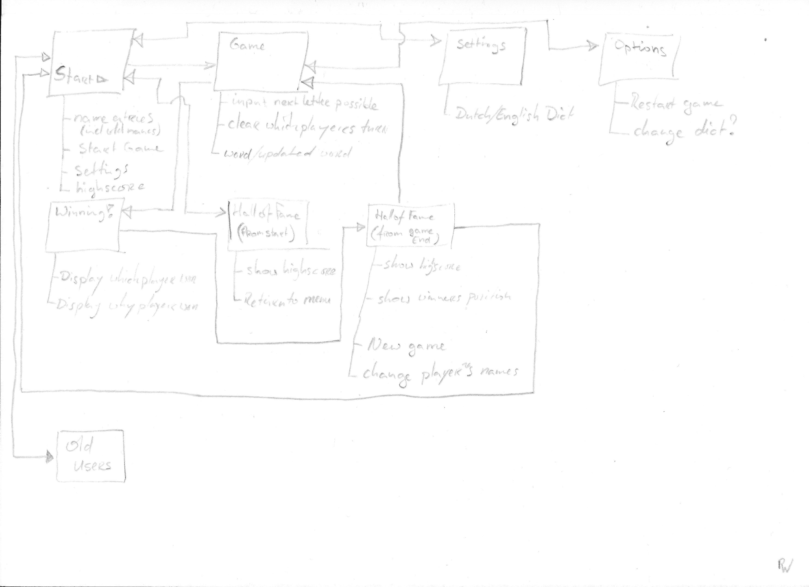
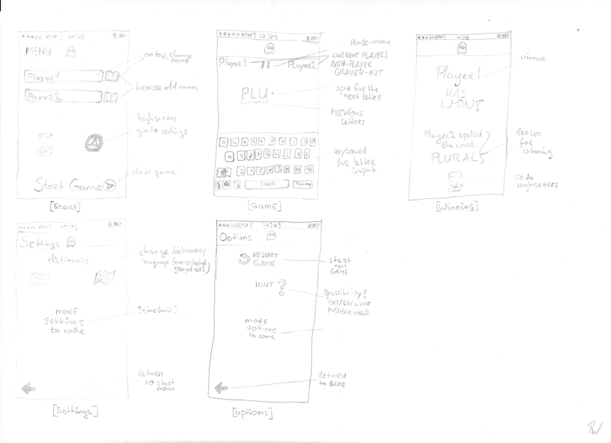
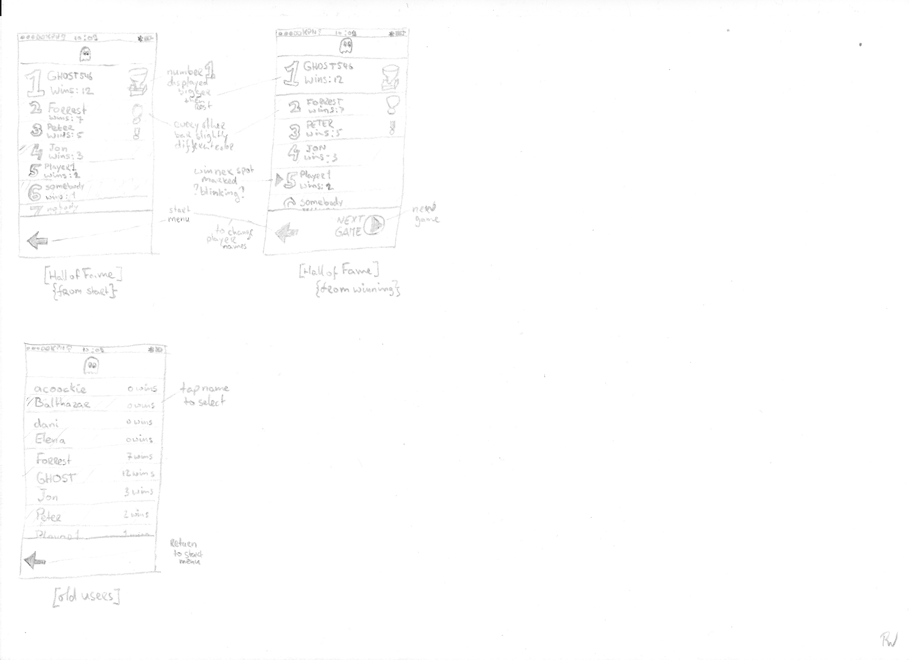

# ghost

Ghost is an app which allows two people to play the game Ghost against each other. 

Features:
- Player vs Player Ghost gameplay!
- Stored Scoreboard (Hall of Fame)!
- Return to play as the same Player (to advance in the Hall of Fame) even after closing the game!
- Play Ghost using a Dutch or an English dictionary!

Sketches of the Game:

